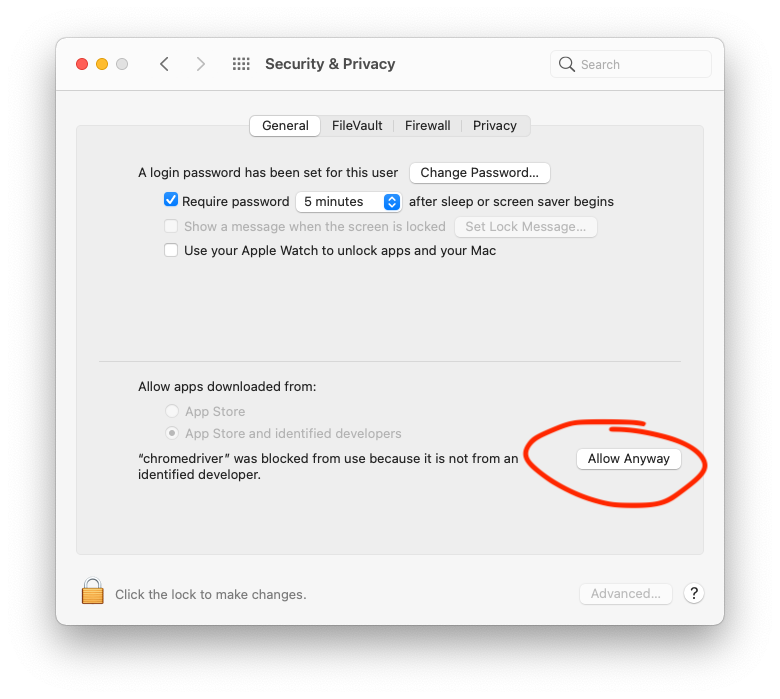

# About

A Clojure CLI tool designed to interact with ATOSS. 

## Usage

### Prerequisite

Create a text file named `.atoss` in your home directory (e.g. `~/.atoss`).

The file should be written in [EDN](https://github.com/edn-format/edn) with the following content:

```edn
{:username "1234567", :password "blablabla"}
```

```bash
atoss-cli log -s "9:15" -e "16:45" -d "16.09.2021"
 
ATOSS CLI by Platogo Interactive Entertainment Gmbh.
Work seamlessly with ATOSS time sheets.

USAGE
  atoss-cli <command> [args]

COMMANDS
  log:       Log time pair for today or a specific date
  view:      View month overview of logged time

  -d, --date DATE        30.09.2021  Date in the format DD.MM.YYYY
  -c, --day-code CODE    nil         Valid ATOSS day code (e.g. wh for WFH) can also be left blank.
  -s, --start-time TIME  9:00        Work start time in the format HH:MM
  -e, --end-time TIME    17:00       Work end time in the format HH:MM
  -v                                 Verbosity level
  -h, --help                         Show this help printout.%
```

For example, if you were working from home today from `9:00` to `17:30`:

```bash
atoss-cli log -c wh -e "17:30"
```

If you are unsure about available day codes, you can always check ATOSS manually.

To view your time logged for the current month, you can use `atoss-cli view`:

```bash
atoss-cli view

Logging into ATOSS with user:  1234567
Logged in
Month overview:

01.09 |  Mi |    - | VGZ |    |     | 09:00 | k | 18:00 | k |  8:30 |  0:48 |
02.09 |  Do |    - | VGZ |  V |     |       |   |       |   |  8:00 |  0:18 |
03.09 |  Fr |    - | VGZ |  V |     |       |   |       |   |  8:00 |  0:18 |
04.09 |  Sa |    - |  // |    |     |       |   |       |   |       |       |
05.09 |  So |    - |  // |    |     |       |   |       |   |       |       |
```

You can always view the available commands and arguments by typing

```bash
atoss-cli --help
```

### Requirements

- `Java Runtime Environment` (at least version 8), I recommend using [Jabba](https://github.com/shyiko/jabba)
- Up to date `chromedriver` and Google Chrome. Download it manually from the [official page](https://chromedriver.chromium.org/downloads) for your operating system, or install it using your package manager

For development, you will need:

- [Clojure](https://clojure.org/guides/getting_started)
- [Leiningen](https://leiningen.org)

I strongly recommend using a combination of Emacs, [Clojure-LSP](https://clojure-lsp.io) and [CIDER](https://docs.cider.mx/cider/index.html).

Fetch deps with `lein deps`

Compile the project with `lein compile`

Run using `lein run` or with an interactive REPL: `lein repl`

Run all tests using `lein test`

### Installation

Clone this repository and run [install.sh](./install.sh).

If you did not build the uberjar locally, you must have the [Github CLI](https://cli.github.com) installed.

Make sure you are either in the office network or connected to the `banana` VPN.

### Updating

Simply run `./install.sh` again, and the latest release should be installed automatically.

### Build

Simply run

```bash

lein uberjar

```

This will build a fully self-contained JAR, ready to be run anywhere.

## Roadmap

  - [x] Add action to view logged time
  - [x] Improve help menu
  - [ ] Build native binary with [GraalVM Native Image](https://www.graalvm.org/reference-manual/native-image/)
  - [ ] Automated time sheet export and upload for submission

## Troubleshooting

### Chromedriver does not start

This is a fairly common issue due to the security model of macOS. It is likely that after an update of `chromedriver`, it needs to be explicitly granted permissions again.

After it tries to launch, make sure to press `Allow` in `System Preferences > Security & Privacy`



### View command fails

This is an issue with ATOSS remembering the time range you have selected in Monthly Overview.

If you run `atoss-cli view`, the day range should match the current month. This will be fixed in a future update.

## License

Copyright © 2021 Daniils Petrovs Platogo Interactive Entertainment Gmbh.

This program and the accompanying materials are made available under the
terms of the Eclipse Public License 2.0 which is available at
http://www.eclipse.org/legal/epl-2.0.

This Source Code may also be made available under the following Secondary
Licenses when the conditions for such availability set forth in the Eclipse
Public License, v. 2.0 are satisfied: GNU General Public License as published by
the Free Software Foundation, either version 2 of the License, or (at your
option) any later version, with the GNU Classpath Exception which is available
at https://www.gnu.org/software/classpath/license.html.
